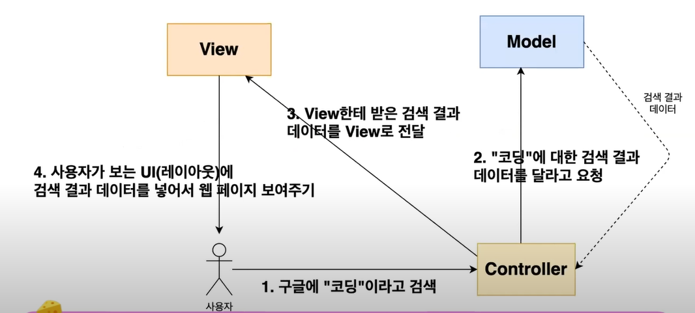

# MVC

- 소프트웨어 개발 방법론

## MVC 탄생 배경

- 코드가 많아 질 수록 복잡도 ↑ => 유지 보수가 불편 함.
- 유지 보수가 편한 pattern(규칙성)을 발표한 논문 = MVC
- 즉 `유지보수가 편해지는 코드 구성 방식`

### Model

- Data와 관련된 일을 하는 곳

### Controller(=View)

- Model과 View의 중계자 역할
- 사용자의 입력이 가장 먼저 들어 오는 곳.

### View(=Template)

- 사용자한테 보여지는 부분을 담당 함.

`*참고 사이트`

[테코톡](https://www.youtube.com/watch?v=ogaXW6KPc8I)