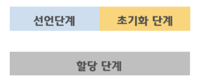

## Hoisting

- 스코프 내부 어디서든, 변수 선언이 최상위에 선언된 것처럼 행동

-  `스코프 안에 있는 선언들을 모두 스코프의 최상단으로 끌어올리는 것`을 의미한다. 호이스팅은 JavaScript 인터프리터가 코드를 해석할 때 `변수 및 함수의 선언 처리`, `실제 코드 실행`의 두단계로 나눠서 처리하기 때문에 발생하는 현상

  ```js
  console.log(name); // undeinfed
  var name = 'Evan';
  ```

  호이스팅이 발생하면서 이 코드는 아래와 같은 방식으로 동작

  ```js
  var name; // 선언부를 제일 위로 끌어올린다.
  
  console.log(name);
  name = 'Evan';
  ```


1. var
   - 호이스팅 되어 선언 전 사용 가능

```javascript
console.log(name) // undefined

var name = 'hyewon'
```


2. let, const
   - 선언 이전 사용 불가능 but 호이스팅 되지 않는 것은 아님
   - Temporal Dead Zone의 영향을 받으며 TDZ에 있는 변수는 사용 불가

```javascript
console.log(name) // ReferenceError

let name = 'hyewon'

----

console.log(name) // ReferenceError

const name = 'hyewon'
```


### 변수 생성 3단계

1. 선언
   - 변수를 실행 컨텍스트의 변수 객체에 등록하는 단계, 스코프가 참조 하는 대상.
2. 초기화
   - 실행 컨텍스트에 존재하는 변수 객체에 선언 단계의 변수를 위한 메모리를 만드는 단계,
     이 단계에서 할당된 메모리에는 undefined로 초기화
3. 할당
   - 사용자가 undefined로 초기화된 메모리의 다른 값을 할당 하는 단계


### var, let, const 변수 생성

1. var
   - 선언과 초기화가 동시에 진행
   - 할당 전 호출하면 undefined

`


2. let

   - 선언 / 초기화 단계 나누어 진행
   - 스코프에 변수 등록(선언) but 초기화 단계는 변수 선언문에 도달 했을 때 이루어짐. 따라서 초기화 이전에 변수에 접근하면 참조에러 발생
   - 코드 블록의 시작 ~ 초기화가 이루어 지는 지점까지 `TDZ`에 빠지기 때문

   ```javascript
   let age = 10; // 전역 변수
   
   {
     console.log(age); // Reference Error
     let age = 29; // 지역 변수
   }
   
   // 호이스팅 되지 않을 경우 전역 변수 값인 10이 출력 됨.
   ```

   

3. const
   - 선언 및 할당을 동시에,
   - 호이스팅은 JavaScript 인터프리터가 코드를 해석하는 과정에서 발생하는 일로 선언을 최상단에서 하기 때문에 호이스팅 되지만, 일시적 사각지대(TDZ)에 들어감.


`* 참고자료`

[블로그](https://evan-moon.github.io/2019/06/18/javascript-let-const/)

[블로그](https://taenami.tistory.com/m/87)